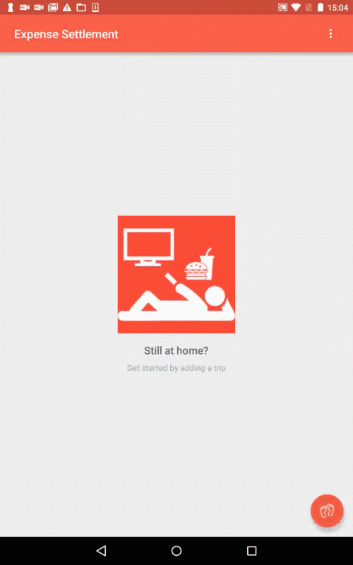
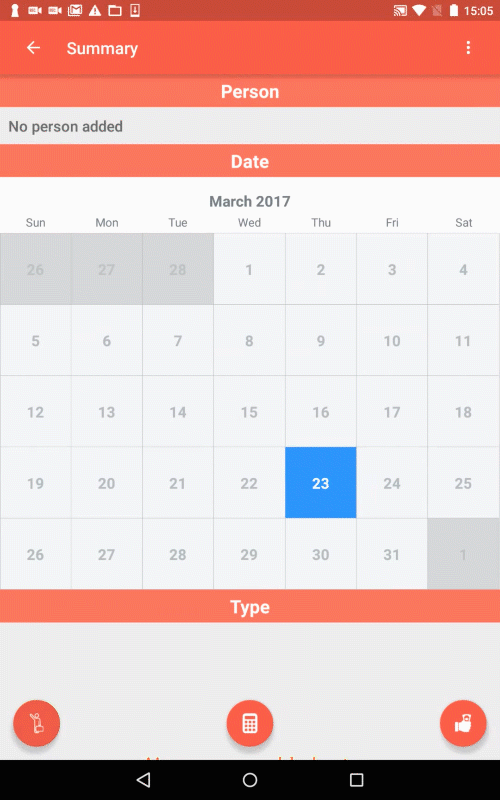
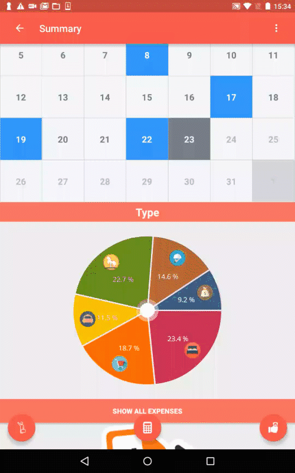
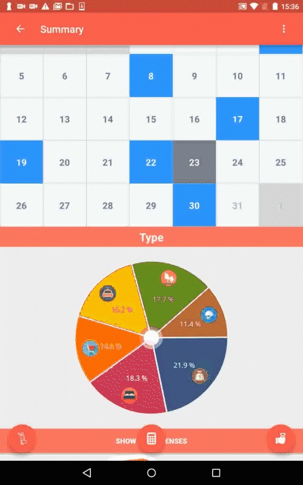
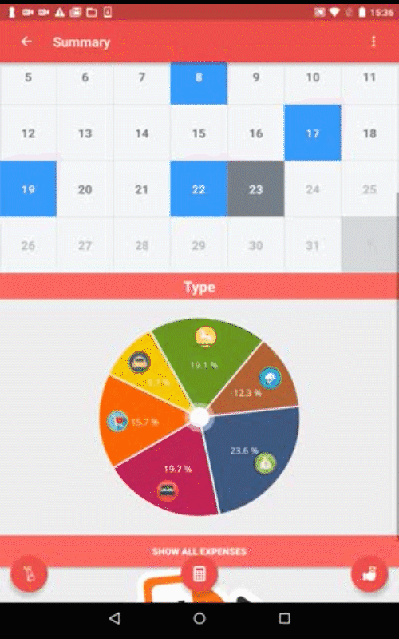

# Overview
This is an Android project to manage trip expenses. The code is built on a sample project from an Android course on Udacity.

## Add a trip

  

## Add a person of the trip

  

## Add an expense of the trip

  

## Update an expense

  

## Delete an expense

  

## Expand the list of all expenses

  

# TODO
- Refactoring ALL the code.
  - RecyclerView
  - Calendar
  - DB
- Designing a better algorithm to solve the real-world problem like a CS student!
- Publish on Google PlayStore!
